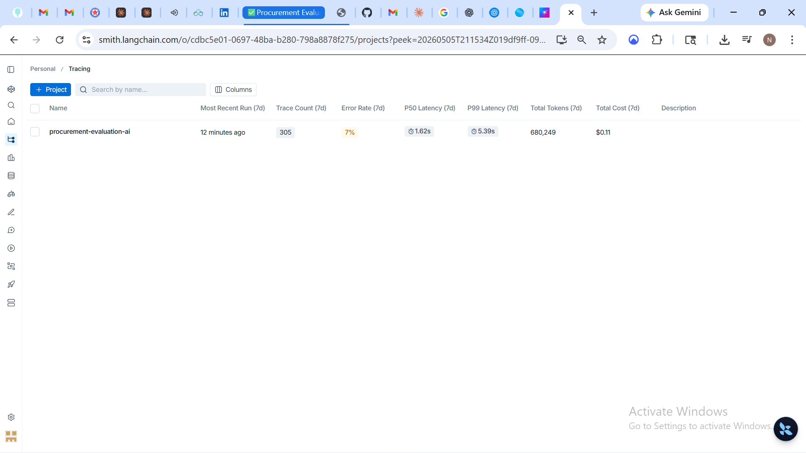
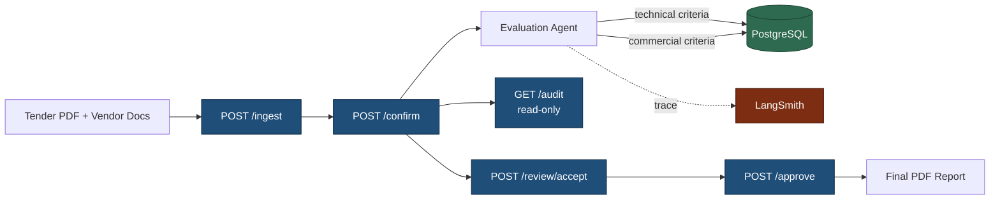

# Procurement Evaluation AI

> Production-grade AI evaluation system for enterprise procurement.

## Overview

End-to-end automated tender evaluation: PDF ingest -> multi-agent criteria extraction -> per-vendor evaluation -> three-tier human review -> audit-grade PDF report. Demonstrated against a synthetic 5-vendor housekeeping tender with full LangSmith observability.

| Metric | Value |
|---|---|
| End-to-end runtime (5 vendors x ~16 criteria) | ~5 minutes |
| Cost per evaluation cycle | $0.06 |
| Test coverage | 149 tests across 4 layers |
| LangSmith traces per run | ~80 |
| Lifetime LLM spend during build | $0.13 |



## Walkthrough

A 3-minute screen walkthrough of the system in action — repo structure, API surface, real-data run results, and LangSmith observability:

[Watch on Loom](https://www.loom.com/share/2c8fb7b6cec847868f569addb780290c)

## Real-data validation

v0.1.0 was tagged after a successful end-to-end run on real vendor documents from a public-sector tender — not just the synthetic housekeeping fixture. A 3-vendor real-data bid pack: 23 PDFs (~50% notarised scans), 9 criteria, ~207 LLM calls, ~$0.50 USD spend. Full lifecycle (`/ingest → /confirm → /review/accept → /approve`) ran clean within configured timeouts.

| Vendor | Technical | Commercial | Matches human evaluator? |
|---|---|---|---|
| Vendor A | ACCEPTED | ACCEPTED | yes |
| Vendor B | REJECTED — PAN missing | ACCEPTED | yes |
| Vendor C | REJECTED — PAN missing | ACCEPTED | yes |

Beyond matching the human accept/reject decision on every vendor, the system flagged that a vendor's PAN submission was missing the **self-attestation** required by the corresponding PQC clause — a verification step a human reviewer skimming 23 PDFs could plausibly miss. Present-but-not-self-attested is a common audit-finding source; catching it on day one is the kind of finding that converts the system from "saves time" to "improves audit posture."

Three small issues surfaced during validation and are documented as deferred fixes in [ADR-0008](docs/adr/ADR-0008-known-issues-v0.1.0.md): a cosmetic `verdict=VALUE` label on document criteria with embedded identifiers, a PDF filename that misses the `eval_id` prefix, and a PowerShell `curl` ergonomics gotcha (the third is fixed below). None affect the accept/reject decision.

## Architecture

The system is structured as a FastAPI service with five sequential lifecycle endpoints, each backed by an idempotent agent. Long-form LLM calls are funneled through a provider-agnostic factory and bounded by a global semaphore for rate-limit safety. Every agent invocation emits a LangSmith trace automatically.



**Key design properties:**

- **Provider-agnostic LLM** -- `ChatOpenAI`, `ChatAnthropic`, and `ChatOllama` are interchangeable via the `LLM_PROVIDER` environment variable. No code changes needed to swap providers.
- **Bounded concurrency** -- A global semaphore (`LLM_MAX_CONCURRENCY`) plus inter-batch sleep (`LLM_INTER_BATCH_SLEEP_SECONDS`) prevent rate-limit failures even under fan-out.
- **Hybrid PDF extraction** -- pdfplumber's text layer first; Tesseract OCR fallback per page when the text layer comes back below `OCR_FALLBACK_THRESHOLD` chars. Handles real procurement bid packs that mix digital docs with notarised scans. Configurable via `OCR_ENABLED`. See [ADR-0006](docs/adr/0006-hybrid-pdf-extraction.md).
- **Per-document evaluation** -- For each (vendor, criterion) pair the agent fans out one LLM call per document and aggregates per-doc verdicts deterministically (any `MEETS` wins). Bounds per-call payload size and gives auditable per-document reasoning, so a 7-vendor / 50+ MB / OCR-heavy real bid pack doesn't trip the model's context-length ceiling. See [ADR-0007](docs/adr/0007-per-document-evaluation.md).
- **Audit-by-default** -- Every state transition writes a row to the lifecycle audit log, surfaced in the final PDF.
- **Observability-by-default** -- Setting `LANGCHAIN_TRACING_V2=true` propagates to the LangChain tracer with no additional wiring.

For full architectural depth, see [docs/ARCHITECTURE.md](docs/ARCHITECTURE.md).

## Demo

The full evaluation pipeline runs in roughly 5 minutes against the synthetic test fixture.

**Prerequisites:**

- Python 3.11+
- PostgreSQL 14+ running locally
- An OpenAI API key (or Anthropic, or local Ollama)
- A LangSmith account with API key (optional, for observability)
- Tesseract OCR binary required for scanned-PDF support — install via `winget install UB-Mannheim.TesseractOCR` on Windows or `apt install tesseract-ocr poppler-utils` on Linux. Skip with `OCR_ENABLED=false` if you only intend to process digital PDFs.

**Setup:**

```bash
git clone https://github.com/Kokkisa/procurement-evaluation-ai.git
cd procurement-evaluation-ai
python -m venv .venv
.\.venv\Scripts\Activate.ps1
pip install -r requirements.txt
cp .env.example .env
# Edit .env: set OPENAI_API_KEY, LANGCHAIN_API_KEY, DATABASE_URL
alembic upgrade head
```

**Run the end-to-end evaluation:**

```bash
python scripts/run_eval_test.py
```

**Expected output:**

```
[1/5] POST /ingest                ... eval_id=DEMO_2026_HKP_001
[2/5] POST /confirm/{eval_id}     ... metadata_confirmed
[3/5] GET  /audit/{eval_id}       ... iteration=1, tech_qualified=3/5, comm_qualified=0/5
[4/5] POST /review/{eval_id}/accept ... status=review_accepted
[5/5] POST /approve/{eval_id}     ... pdf_path=data/outputs/DEMO_2026_HKP_001_iter1_technical_evaluation.pdf
                                      pdf size = 13986 bytes
```

**Generated artifacts:**

| Artifact | Location |
|---|---|
| Final PDF report | `data/outputs/*.pdf` |
| LangSmith trace tree | https://smith.langchain.com |
| Audit log | PostgreSQL `audit_log` table + final PDF |

The PDF is structured as five pages: header + tender metadata, technical evaluation matrix (per-criterion verdicts per vendor), commercial evaluation matrix, overall remarks with accept/reject rationale, and the lifecycle audit log + signature blocks.

Sample screenshots: [page 1 (header + technical matrix)](docs/images/pdf_page1_header_techmatrix.png), [page 2 (overall remarks)](docs/images/pdf_page2_overall_remarks.png), [page 5 (audit log + signatures)](docs/images/pdf_page5_audit_signatures.png).

## Calling the API from Windows PowerShell

PowerShell aliases `curl` to its native `Invoke-WebRequest` cmdlet, which has incompatible argument semantics — `-X POST -d '{...}'`-style invocations URL-encode the body into the query string and never set `Content-Type`, so FastAPI returns `422 Unprocessable Entity`. Use `Invoke-RestMethod` instead, with the body as a JSON string and `-ContentType "application/json"`:

```powershell
# /confirm
Invoke-RestMethod -Method POST `
    -Uri "http://localhost:8000/confirm/$evalId" `
    -ContentType "application/json" `
    -Body '{"actor_id":"preparer1"}'

# /review/accept
Invoke-RestMethod -Method POST `
    -Uri "http://localhost:8000/review/$evalId/accept" `
    -ContentType "application/json" `
    -Body '{"actor_id":"reviewer1"}'

# /approve
Invoke-RestMethod -Method POST `
    -Uri "http://localhost:8000/approve/$evalId" `
    -ContentType "application/json" `
    -Body '{"actor_id":"approver1"}'

# /audit  (GET, no body)
Invoke-RestMethod -Method GET -Uri "http://localhost:8000/audit/$evalId"
```

If you'd rather use real `curl` from PowerShell, either invoke it through Git Bash (`bash -c "curl ..."`) or call the absolute path explicitly: `& "C:\Windows\System32\curl.exe" -X POST ...`. macOS, Linux, and Git Bash users can use the `curl` examples elsewhere in this README without any of this gymnastics.

## Design Decisions

Seven architectural decisions are recorded as ADRs:

| ADR | Decision | Status |
|---|---|---|
| [0001](docs/adr/0001-provider-agnostic-llm-factory.md) | Provider-agnostic LLM factory | Accepted |
| [0002](docs/adr/0002-bounded-concurrency-orchestration.md) | Bounded concurrency for LLM orchestration | Accepted |
| [0003](docs/adr/0003-langsmith-env-propagation.md) | Propagate LangSmith env vars to `os.environ` | Accepted |
| [0004](docs/adr/0004-multi-model-cascade-proposed.md) | Multi-model cascade for quality on borderline cases | Proposed (v0.2) |
| [0005](docs/adr/0005-gold-standard-verification-deferred.md) | Defer gold-standard verification fix | Accepted |
| [0006](docs/adr/0006-hybrid-pdf-extraction.md) | Hybrid PDF extraction (text layer + OCR fallback) | Accepted |
| [0007](docs/adr/0007-per-document-evaluation.md) | Per-document vendor evaluation (handles 100K+ token vendor inputs) | Accepted |

The two most consequential decisions during the build were:

**Bounded concurrency vs raw fan-out** -- An early version attempted unbounded async fan-out across vendors and criteria, which produced ~135K input tokens/min spikes and tripped Anthropic's Tier 1 rate limit. The fix was a single global semaphore wrapping all LLM calls, plus an inter-batch sleep to amortize across the rolling token-counting window. See ADR-0002 for the math.

**LangSmith env-var propagation** -- LangChain's auto-tracer reads `os.environ` directly. `pydantic-settings` loads `.env` values into a `Settings` object but does not export them back to `os.environ`. Result: manual scripts that called `load_dotenv()` produced traces; agent runs through FastAPI did not. Fix: a `_propagate_langsmith_to_environ()` helper invoked once after `Settings()` construction, using `os.environ.setdefault` so real shell-exported values still win in production. See ADR-0003.

## Tech Stack

| Layer | Choice | Why |
|---|---|---|
| API | FastAPI | Async-native, structured-output-friendly, easy to instrument |
| LLM orchestration | LangChain (Runnable composition) | Provider-agnostic, structured output via `with_structured_output(Schema)`, automatic LangSmith integration |
| LLM providers | OpenAI (gpt-4o-mini), Anthropic (Claude Sonnet), Ollama (local) | Swappable via `LLM_PROVIDER`; production defaults to OpenAI for cost and rate-limit headroom |
| Observability | LangSmith | Trace tree per agent run, token + cost rollups, latency percentiles |
| Persistence | PostgreSQL + SQLAlchemy + Alembic | Idempotent migrations, audit log primary store |
| Config | `pydantic-settings` | 12-factor with `.env` loading and shell-override semantics |
| PDF generation | ReportLab | Programmatic table layouts, deterministic output for audit reproducibility |
| Concurrency | `asyncio.Semaphore` | Single global gate around LLM calls; survives provider swaps |
| Testing | pytest + pytest-asyncio | Unit + gated integration + E2E layers |

## Testing

The test suite has 149 passing tests organized into four layers:

| Layer | Count | Run command | Cost |
|---|---|---|---|
| Unit | ~120 | `pytest tests/unit/` | Free |
| Config | 9 | `pytest tests/test_config.py` | Free |
| Integration (mocked) | ~20 | `pytest tests/integration/` | Free |
| Live LLM (gated, 13 tests) | 13 | `RUN_LIVE_LLM_TESTS=1 pytest -m live` | ~$0.05/full run |

The live tests are gated behind `RUN_LIVE_LLM_TESTS=1` so the default `pytest` invocation is fast (~6 seconds) and does not consume API credits. CI runs the first three layers; live tests are run manually before tagged releases.

Test environment isolation is enforced via `tests/conftest.py`, which forces `LANGCHAIN_TRACING_V2=false` and `LLM_INTER_BATCH_SLEEP_SECONDS=0` regardless of `.env` settings. This prevents production rate-limit tuning from slowing the CI suite.

## Observability

LangSmith integration is enabled by setting three environment variables:

```
LANGCHAIN_TRACING_V2=true
LANGCHAIN_API_KEY=<your-key>
LANGCHAIN_PROJECT=procurement-evaluation-ai
```

After this, every agent invocation emits a trace automatically. No code changes required.

A typical end-to-end run produces ~80 traces in the LangSmith dashboard:

- One parent run per criterion evaluation
- Token usage per call (input / output / cached)
- Latency P50 / P99 per agent type
- Total cost rollup across the run
- Full prompt + structured response visible per trace

This makes it trivial to debug regressions ("which criterion now produces a different verdict?"), measure cost ("does the new prompt template increase tokens?"), and identify latency outliers ("which vendor is consistently slow?").

Sample LangSmith views: [aggregate dashboard](docs/images/langsmith_aggregate_hero.png), [single trace detail](docs/images/langsmith_trace_detail_hero.png).

## What's Next

Roadmap for v0.2:

- **Multi-model cascade for borderline cases** -- Use gpt-4o-mini as first-pass evaluator for the ~80% of criteria with unambiguous answers, and escalate to Claude Sonnet (or gpt-4o) only when the draft confidence falls below a tunable threshold. Total per-run cost increases (cents-per-run range, not order-of-magnitude), but quality on nuanced criteria likely improves. Promotion from Proposed to Accepted requires measured precision/recall data on a labeled borderline-case dataset, which we do not yet have. See [ADR-0004](docs/adr/0004-multi-model-cascade-proposed.md).
- **Gold-standard verification fix** -- Split the verification harness into separate `tech_expected` and `comm_expected` fields so the script no longer reports MISSING for vendors that are correctly evaluated. See [ADR-0005](docs/adr/0005-gold-standard-verification-deferred.md) and [docs/known-issues.md](docs/known-issues.md).
- **Streamlit reviewer UI** -- A web UI for the human-review step (currently driven by direct API calls). Faster turnaround during iterative evaluation cycles.
- **Multi-tenant deployment** -- Per-tenant database schemas + row-level security for production multi-customer use.
- **Kubernetes manifests** -- Helm chart for production deployment with horizontal pod autoscaling on FastAPI workers.

## License

MIT
