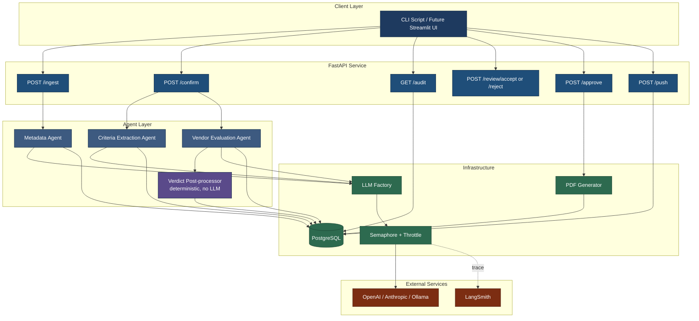

# Architecture

This document describes the system in enough depth that a new contributor can navigate the code, an engineer reviewing the repo can evaluate the design choices, and a future maintainer can decide where to make changes.

The README's Architecture section is the 60-second summary. This is the unabridged version.

## System Diagram



## Lifecycle

A complete tender evaluation traverses six FastAPI endpoints. Five are write endpoints that advance state; one (`GET /audit`) is read-only. Each write endpoint is idempotent on its `eval_id` and writes one or more rows to the `audit_log` table on success.

### 1. POST /ingest

**Input:** Multipart form: tender PDF + one-or-more vendor archives (`.zip` or individual `.pdf`).

**Behavior:**
- Generates a unique `eval_id` (UUID).
- Persists the raw uploads under `{settings.upload_dir}/{eval_id}/{tender.pdf, vendors/<slug>/...}`. ZIP archives are unzipped per-vendor; loose PDFs land in their own per-vendor folder.
- The Metadata Agent extracts structured metadata from the tender PDF (tender number, floated date, bid due date, issuing office, location).
- The vendor index is built deterministically from the on-disk folder structure (no LLM).
- Output stored on the `evaluations` row: `tender_metadata_json` (full TenderMetadata as JSONB), plus the four denormalised fields (`tender_number`, `tender_name`, `tender_floated_date`, `tender_due_date`) for indexing.

**Audit log entries:** `uploaded` (preparer), then `metadata_extracted` (system).

**Status transition:** (none) → `metadata_extracted`.

**Why metadata is extracted here:** Metadata extraction is the cheapest agent call (~3K input tokens, single shot). Running it inline with ingest gives the confirmation popup something to show and lets a human catch a misread tender number before the much more expensive evaluation phase fires.

### 2. POST /confirm/{eval_id}

**Input:** `eval_id` + actor_id (preparer).

**Behavior:**
- The Criteria Extraction Agent reads the tender PDF text and emits the rubric: technical criteria (typically 7-9) + commercial criteria (typically 7-8). Output is validated against the `TenderRubric` Pydantic schema.
- The Vendor Evaluation Agent fans out across all vendors × all criteria for both rubrics. The same agent class handles both technical and commercial criteria with different criterion lists; there is no separate "commercial agent". This is the high-fan-out phase that the bounded-concurrency layer is designed to handle.
- Each per-(vendor, criterion) call produces a `CriterionEvaluation`: verdict (`PROVIDED` / `NOT_PROVIDED` / `VALUE` / `PARTIAL`), `extracted_value`, `threshold_met`, `reasoning`, `source_document`, `confidence`.
- Per-vendor accept/reject + remarks are computed by `verdict.compute_overall_verdict()` — a deterministic Python function, not an LLM call. Rejection messages structurally mirror the spec's pattern: `"Vendor did not meet X threshold of Y Lakhs (MSME-relaxed). Provided value: Z. Hence rejected."`
- Aggregated `TechnicalEvaluation` and `CommercialEvaluation` JSON blobs are written to the `evaluations` row.

**Audit log entries:** `metadata_confirmed` (preparer), then `evaluation_generated` (system), then `sent_for_review` (preparer).

**Status transition:** `metadata_extracted` → `metadata_confirmed` → `eval_ready`.

**LLM call profile:**
- Criteria extraction: 1 call, ~5K input tokens.
- Vendor evaluation (technical): 5 vendors × ~7-9 criteria = ~40 calls.
- Vendor evaluation (commercial): 5 vendors × ~7-8 criteria = ~40 calls.
- **Total: ~80-85 calls per /confirm invocation.** This is where bounded concurrency matters most.

### 3. POST /review/{eval_id}/accept or /reject

**Input:** `eval_id` + actor_id (reviewer). On reject also `feedback_text`.

**Behavior on accept:**
- Records the reviewer's accept on the `evaluations` row.

**Behavior on reject:**
- Snapshots the previous `technical_eval_json` + `commercial_eval_json` into the `re_evaluation_triggered` audit-log row's `notes` field (truncated to 1KB) so prior iterations remain inspectable.
- Increments `iteration` counter (`iter1` → `iter2`, ...).
- Re-invokes Criteria Extraction Agent + Vendor Evaluation Agent with `feedback_text` plumbed into the criteria prompt as a `feedback_section`. Spec ADR-0004 of the build spec calls for full re-run, not patch — patching would risk inconsistency between cells.
- Status returns to `eval_ready` so the reviewer can act on the new iteration.

**Audit log entries:** `review_accepted` (reviewer) on accept; `review_rejected` + `re_evaluation_triggered` + `evaluation_generated` + `sent_for_review` on reject.

**Status transition:** `eval_ready` → `review_accepted` (accept) | `eval_ready` (reject, after re-run).

**Why a human in the loop:** Procurement is a regulated process. Decisions like "this vendor is rejected" require accountable approval, not pure automation. The system is designed to do the work; a human approves it.

### 4. POST /approve/{eval_id}

**Input:** `eval_id` + actor_id (approver).

**Behavior:**
- Reconstructs the typed payload from the JSONB blobs on the `evaluations` row.
- Loads the chronological `audit_log` rows.
- Hands everything to the PDF generator (ReportLab). Output: `{settings.output_dir}/{tender_number_safe}_iter{N}_technical_evaluation.pdf`.
- The path is returned in the response and stored in the `approved` audit-log row's notes.

**Audit log entry:** `approved` (approver).

**Status transition:** `review_accepted` → `approved`.

**No LLM call at this stage.** All synthesis is deterministic — the per-vendor `overall_remarks` was already computed by `verdict.compute_overall_verdict()` during /confirm and lives inside `vendor_evaluations[i].overall_remarks`.

### 5. POST /push/{eval_id}

**Input:** `eval_id` + actor_id (approver).

**Behavior:**
- Snapshots the full evaluation + chronological audit log into a single JSONB blob on a new `archive` row.
- Flips the source `evaluations.status` to `complete_and_pushed`. The working row is **not deleted** — that would orphan the `audit_log.evaluation_id` foreign key. The "move" is logical, not physical.

**Audit log entry:** `complete_and_pushed` (approver).

**Status transition:** `approved` → `complete_and_pushed`.

### Read-only: GET /audit/{eval_id}

Returns the chronological audit-log events for one evaluation plus the current `iteration` and `status`. Used by the Streamlit sidebar and `scripts/run_eval_test.py` to verify the lifecycle state without mutating it.

### Read-only: GET /health

Returns `{status, version, timestamp}`. Used by container orchestrators for liveness probes.

## Component Responsibilities

### LLM Factory (`src/proceval/llm_factory.py`)

Single function `get_chat_model()` that reads `settings.llm_provider` and returns the configured LangChain chat model. Encapsulates provider-specific setup (model name, API key, max tokens, temperature).

Returning a LangChain `BaseChatModel` rather than a raw client gives downstream code access to:
- `.with_structured_output(Schema)` for Pydantic-validated responses.
- Runnable composition: `prompt | model | parser`.
- Automatic LangSmith tracing.

This is documented in [ADR-0001](adr/0001-provider-agnostic-llm-factory.md).

### Concurrency Layer

A module-level `asyncio.Semaphore(LLM_MAX_CONCURRENCY)` wraps every LLM call site. Inside the semaphore-held block, an `asyncio.sleep(LLM_INTER_BATCH_SLEEP_SECONDS)` runs after the call completes, holding the slot until the rolling-window token budget recovers.

Critical: the semaphore is **module-level**, not per-agent. Multiple agents running in parallel share the same gate. Without this, parallel agent invocations double the effective concurrency and defeat the cap.

This is documented in [ADR-0002](adr/0002-bounded-concurrency-orchestration.md).

### Agents (`src/proceval/agents/`)

Three LLM-driven agents plus one deterministic post-processor:

| Module | Class / function | Input | Output | LLM calls |
|---|---|---|---|---|
| `metadata_agent.py` | `MetadataExtractionAgent` | Tender PDF text | `TenderMetadata` Pydantic | 1 |
| `criteria_agent.py` | `CriteriaExtractionAgent` | Tender PDF text + extracted metadata | `TenderRubric` Pydantic (technical + commercial criteria) | 1 |
| `evaluation_agent.py` | `VendorEvaluationAgent` | Vendor docs blob + one criterion | `CriterionEvaluation` Pydantic | 1 per (vendor × criterion) |
| `verdict.py` | `compute_overall_verdict()` | All `CriterionEvaluation` results for one vendor | `(overall_verdict, overall_remarks)` | **0 — pure Python, no LLM** |

The "Vendor Evaluation Agent" is one class. Technical and commercial evaluations use the same agent — they just pass different criterion lists from the rubric. There is no separate commercial agent; the rubric itself is structured so the same per-criterion call shape works for both.

The roll-up from per-criterion verdicts to per-vendor accept/reject + remarks lives in `verdict.py` and is **deterministic Python**, not an LLM call. This was a deliberate design choice — auditability + reproducibility win over flexibility for the final aggregation step. ADR-0002 in the build spec memo (not committed) captures this decision; the live build chose verdict.py for those reasons.

Each LLM agent:
1. Builds a `ChatPromptTemplate` from a text-file prompt template under `src/proceval/agents/prompts/`.
2. Composes with `.with_structured_output(Schema)` for Pydantic validation.
3. Acquires the instance-level `asyncio.Semaphore` (which enforces the global concurrency cap; see "Concurrency Layer" above) before calling the LLM.
4. Returns the parsed Pydantic model up to the route handler, which persists to PostgreSQL.

Agents do not call tracing primitives directly. LangSmith auto-traces by reading `os.environ['LANGCHAIN_TRACING_V2']`.

### Configuration (`src/proceval/config.py`)

`pydantic-settings` loads `.env` into a `Settings` object. Critical addition: a `_propagate_langsmith_to_environ()` helper invoked once after `Settings()` construction, mirroring the three LangSmith fields back to `os.environ` so LangChain's auto-tracer can read them.

This is documented in [ADR-0003](adr/0003-langsmith-env-propagation.md).

### Persistence (`src/proceval/db/`)

PostgreSQL 18 with SQLAlchemy 2.x + Alembic migrations. Four tables:

- **`evaluations`** — one row per `eval_id`. Tracks lifecycle status, iteration counter, preparer/reviewer/approver IDs, reviewer feedback, and three JSONB columns that hold the full typed payloads:
  - `tender_metadata_json` — full `TenderMetadata` (issuing organisation, location, dates, etc.) so /confirm and /review/reject re-runs don't have to re-extract from the PDF.
  - `technical_eval_json` — full `TechnicalEvaluation` (rubric + per-vendor results + qualified count + summary remarks).
  - `commercial_eval_json` — full `CommercialEvaluation` with the same shape.
- **`audit_log`** — append-only lifecycle event log; one row per state-changing call. Foreign-keyed to `evaluations.id`. The source of truth for the PDF audit trail.
- **`archive`** — per-tender snapshot of the full evaluation + audit log, written by /push. The working `evaluations` row stays intact (so the audit-log FK remains valid); /push is a logical move, not a physical row delete.
- **`documents`** — per-file tracking row (vendor name, document type, file path, extracted text, page count) for every PDF uploaded under one `eval_id`. Useful for the audit trail and any later "did the LLM see this doc?" diagnostics.

Schema highlights — fields that aren't immediately obvious:

- `evaluations.iteration` — increments on every `/review/reject` re-run; appears in the PDF filename.
- `evaluations.tender_metadata_json` exists alongside the four denormalised metadata fields (`tender_number`, `tender_name`, `tender_floated_date`, `tender_due_date`); the JSON column is for full reconstruction, the columns are for indexed queries.
- The metadata, criteria, and per-(vendor, criterion) results are **stored as JSON inside `evaluations`**, not in separate tables. The system is single-tenant + write-once at the evaluation level; relational decomposition would add migration complexity for no query benefit at v0.1 scale.

Migrations are idempotent. `alembic upgrade head` is safe to re-run.

### PDF Generation (`src/proceval/pdf/report_generator.py`)

ReportLab Platypus, A4 landscape, four pages for the synthetic 5-vendor evaluation. Logical sections in order:

1. **Header band** — dark navy `#1f3349`, white text. Centred "PROCUREMENT EVALUATION REPORT", tender number + name, issuing org + iteration counter + generated timestamp.
2. **Tender metadata block** — compact 2-column key/value grid (floated date, due date, issuing office, tender number).
3. **Participating vendors** — numbered list with `[MSME]` tag inline.
4. **Technical evaluation matrix** — criteria as rows, vendors as columns; verdict-coded cells (light green pass / light red fail / light yellow partial / light grey N/A); `VALUE` cells render the extracted value in Courier-Bold for emphasis.
5. **OVERALL REMARKS row** at the bottom of each matrix — dark navy band; per-vendor cells get dark green (`ACCEPTED`) or dark red (`REJECTED`) backgrounds. The remarks string is what `verdict.compute_overall_verdict()` returned during /confirm, not freshly synthesised.
6. **Commercial evaluation matrix** — same shape, only emitted if the commercial rubric has criteria.
7. **Lifecycle audit log appendix** — chronological 6-column table (`#`, `When (UTC)`, `Action`, `Role`, `Actor`, `Notes`); notes truncated at 200 chars.
8. **Signature blocks** — 6×3 table (Prepared By / Reviewed By / Approved By); a 32pt blank row reserved for the wet signature.

Filename: `<tender_number_safe>_iter<N>_technical_evaluation.pdf` so re-evals don't overwrite earlier iterations.

The PDF renders identically every run for the same input. No randomness, no timestamps inside the matrix cells. This is deliberate: deterministic PDFs are auditable.

## Data Flow Summary

```
Tender PDF + Vendor Docs
    |
    v
[POST /ingest]  --> data/uploads/{eval_id}/      --> audit_log: uploaded
    |               + Metadata Agent (1 LLM call)   audit_log: metadata_extracted
    |               --> evaluations.tender_metadata_json
    |               +--> LangSmith trace
    v
[POST /confirm] --> Criteria Agent (1 LLM call)
    |               + Vendor Evaluation Agent      audit_log: metadata_confirmed
    |                 (~80 calls under bounded      audit_log: evaluation_generated
    |                  concurrency)                 audit_log: sent_for_review
    |               + verdict.compute_overall_verdict() (no LLM)
    |               --> evaluations.{technical,commercial}_eval_json
    |               +--> ~80 LangSmith traces
    v
[GET  /audit]   --> read-only view of audit_log + iteration + status
    |
    v
[POST /review/  --> reviewer accept | reject     audit_log: review_accepted
       accept]      (reject re-runs the chain     | review_rejected +
                    with feedback_text plumbed    |   re_evaluation_triggered +
                    into the criteria prompt)     |   evaluation_generated +
                                                  |   sent_for_review
    |
    v
[POST /approve] --> assembles full payload from JSONB blobs + audit log
    |               --> PDF Generator (ReportLab; deterministic, no LLM)
    |               --> data/outputs/{tender_safe}_iter{N}_technical_evaluation.pdf
    |               +--> audit_log: approved
    v
[POST /push]    --> snapshot to archive table
                    flip status to complete_and_pushed
                    (logical move; evaluations row not deleted)
                    +--> audit_log: complete_and_pushed
    v
Final Audit-Grade PDF + Archive Snapshot
```

## Performance Characteristics

Measured in two successful end-to-end runs (Block 10):

| Metric | Value | Notes |
|---|---|---|
| Wall-clock runtime | ~5 minutes | At cap=1, sleep=10s tuning |
| Total LLM calls | ~80-85 | Per evaluation |
| Total input tokens | ~340K | Per evaluation |
| Total output tokens | ~25K | Per evaluation |
| Cost per evaluation | $0.06 | gpt-4o-mini |
| LangSmith P50 latency | 1.62s | Per call |
| LangSmith P99 latency | 5.39s | Per call |
| Error rate | 7% | Acceptable; tracked per-criterion |
| Database writes | ~120 rows | Across all tables |

The 7% error rate is from gpt-4o-mini occasionally producing structured outputs that fail Pydantic validation on the first try. The system retries automatically; a 7% first-try failure rate translates to ~0% terminal failure rate after retry.

## Operational Characteristics

| Concern | How it's handled |
|---|---|
| Rate limits | Bounded concurrency + inter-batch sleep ([ADR-0002](adr/0002-bounded-concurrency-orchestration.md)) |
| Provider outages | LangSmith trace shows the failure; manual retry via re-running the relevant endpoint |
| Bad LLM output | Pydantic schema validation; retry inside the agent; ultimately a human review step (POST /review/accept-or-reject) |
| Network partition during evaluation | Idempotent endpoints; replay from last successful audit_log entry |
| Database lock contention | Per-`eval_id` row locking on the `evaluations` table; concurrent evaluations of different `eval_id`s do not contend |
| Configuration drift | `.env.example` checked in; `pydantic-settings` validates on import; missing required values fail fast |

## Security Posture (v0.1)

This is a v0.1 portfolio system. Production deployment would require:

- API authentication (currently no auth; deployed behind a private network).
- API key rotation policies (currently keys live in `.env`).
- Audit log immutability (currently append-only at the application layer; production would use database triggers or an external write-once store).
- Vendor document encryption at rest (currently plaintext under `data/uploads/`).
- Rate limiting at the FastAPI layer (currently relies on upstream provider rate limits).

These are documented as v0.2+ work in the README's "What's Next" section.

## File Layout

```
procurement-evaluation-ai/
├── src/proceval/
│   ├── agents/             # 3 LLM agents + verdict.py (deterministic)
│   │   ├── metadata_agent.py
│   │   ├── criteria_agent.py
│   │   ├── evaluation_agent.py
│   │   ├── verdict.py
│   │   └── prompts/        # text-file prompt templates
│   ├── api/                # FastAPI routers + lifecycle endpoints
│   │   ├── routes/         # health, ingest, evaluate, review, approve, audit
│   │   ├── deps.py         # DI for DB session + agents
│   │   ├── services.py     # shared run_full_evaluation pipeline
│   │   ├── state.py        # EvalStatus + transition guards
│   │   └── main.py         # FastAPI app
│   ├── audit/              # log_event helper (append-only writer)
│   ├── db/                 # SQLAlchemy models + Alembic migrations
│   ├── ingestion/          # zip handling + pdf_parser + vendor index
│   ├── pdf/                # ReportLab PDF generator
│   ├── schemas/            # Pydantic models for every payload
│   ├── config.py           # pydantic-settings + LangSmith env propagation
│   └── llm_factory.py      # Provider-agnostic chat model factory
├── src/ui/                 # Streamlit frontend (state-driven routing)
├── tests/
│   ├── conftest.py         # Test env isolation (LANGCHAIN_TRACING_V2=false,
│   │                       #   LLM_INTER_BATCH_SLEEP_SECONDS=0)
│   ├── fixtures/           # Synthetic tender + 5 vendor folders
│   └── test_*.py           # Flat layout — one file per concern
│                           #   (no unit/ or integration/ subdirs;
│                           #    live-LLM tests are gated via
│                           #    RUN_LIVE_LLM_TESTS=1 env var)
├── scripts/
│   ├── run_eval_test.py            # Full E2E demo
│   ├── generate_synthetic_vendors.py
│   ├── render_matrix_preview.py    # Streamlit-matrix HTML preview
│   ├── render_pdf_preview.py       # Final-PDF preview
│   └── check_no_secrets.py         # Pre-commit secret guard
├── docs/
│   ├── adr/                # Architecture Decision Records (5 ADRs)
│   ├── images/             # Hero screenshots (LangSmith + PDF)
│   ├── ARCHITECTURE.md     # This file
│   └── known-issues.md     # User-facing v0.1 known issues
├── data/
│   ├── uploads/            # Uploaded tender + vendor docs (per eval_id)
│   ├── outputs/            # Generated PDFs
│   └── samples/            # Sample fixtures for the README quickstart
├── deploy/
│   ├── Dockerfile
│   ├── docker-compose.yml
│   └── k8s/                # Manifests (committed, not deployed in v0.1)
└── README.md
```

## Where to make changes

| If you want to... | Change here |
|---|---|
| Add a new LLM provider | `src/proceval/llm_factory.py` |
| Tune throttling | `.env` (production) or `tests/conftest.py` (test) |
| Add a new agent | `src/proceval/agents/`, plus a corresponding endpoint in `src/proceval/api/` |
| Change the PDF layout | `src/proceval/pdf/report_generator.py` |
| Add an audit lifecycle event | `src/proceval/db/models.py` (audit_log) and the relevant endpoint |
| Update prompts | `src/proceval/agents/prompts/<agent>_*.txt` -- prompts live in text files alongside the agent module |
| Change the database schema | New Alembic migration in `src/proceval/db/migrations/versions/` |

## Related Documents

- [README.md](../README.md) -- 60-second project overview
- [docs/known-issues.md](known-issues.md) -- Known v0.1 issues
- [docs/adr/](adr/) -- 5 Architecture Decision Records covering provider abstraction, concurrency, observability, cost optimization (proposed), and verification deferral
